# istio-service-mesh

### Monolithic
Earlier: the app has some services internally like amazon (dtails, reviews, rating,...) each service

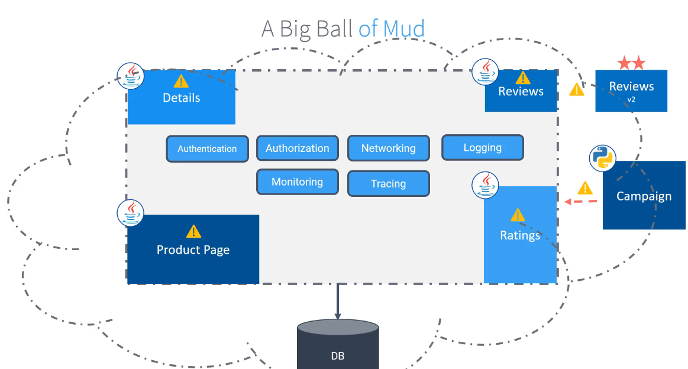

While trying to update one of these services it stops or could break the whole app.

### Microservices

It keep each of these service in a separate microservice independantly, each could be writing in a differant programming language

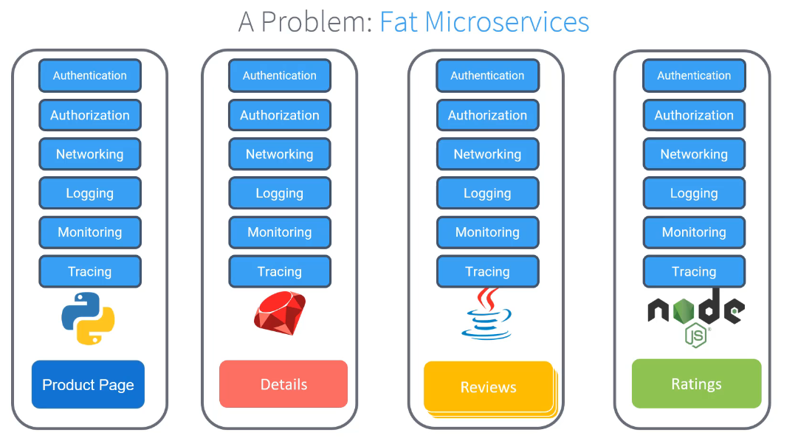

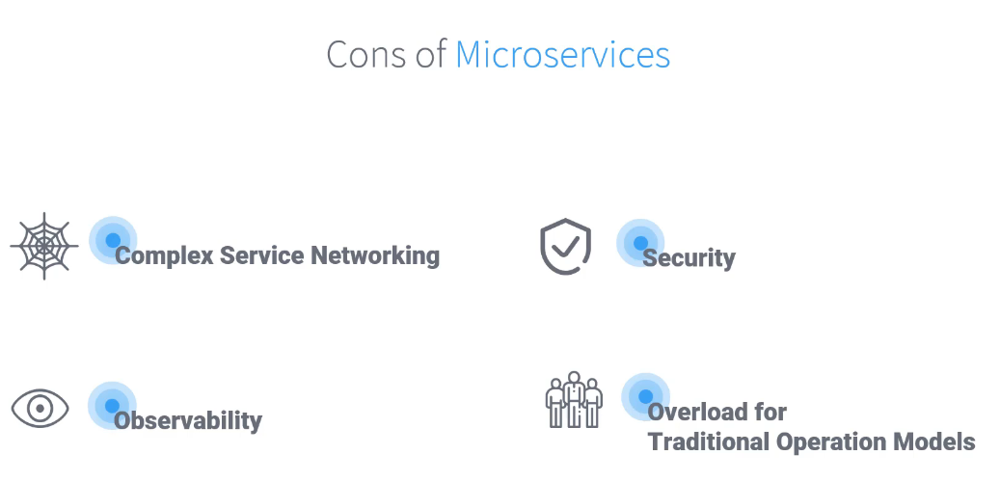

But it still ain't easy right.

All services talk to each other, it need monitoring, security connection and other things >> that's `service mesh` comes for.

## Service Mesh


- It deplys a sidecar `proxy` pod on top of each microservice to handle all above concerns as shown

  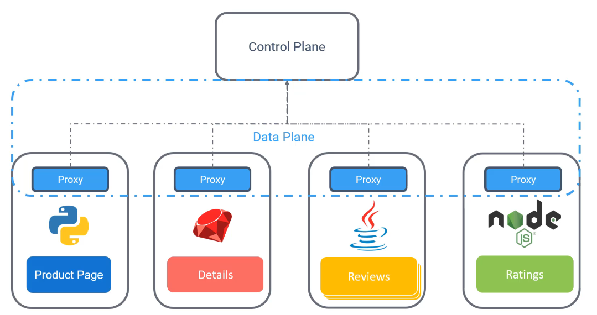

### Istio

- It uses Envoy as a proxy
- Control plane has:
  - Citadel: cert generation
  - Pilot: service descovry
  - Galley: config validation

  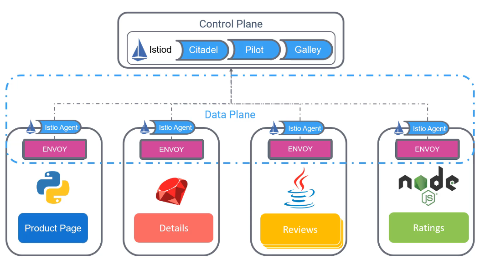

> she used istioctl to deploy it to the cluster, but also with have helm and operstor options

## Demo

Install `istio`
- [Doc](https://istio.io/latest/docs/setup/install/istioctl/)

```bash
curl -L https://istio.io/downloadIstio | sh -
cd istio-1.29.1
export PATH=$PWD/bin:$PATH
```

- To check if namespace is ok with istio check with
    
  ```bash
  istioctl analyzer
  ```

- You can enable istio to run in a specific NS with `istio-injection=enabled` label.

## Kiali

- Is a dashboard used for visualizing the traffic within the istio

it's downloaded with the istio dir as an addon.

After deploying the addon you'll need `kiali-svc.yaml`

## Gatways

- We have 2 gateways, `ingress` and `egress` gateways.
- Ingress

  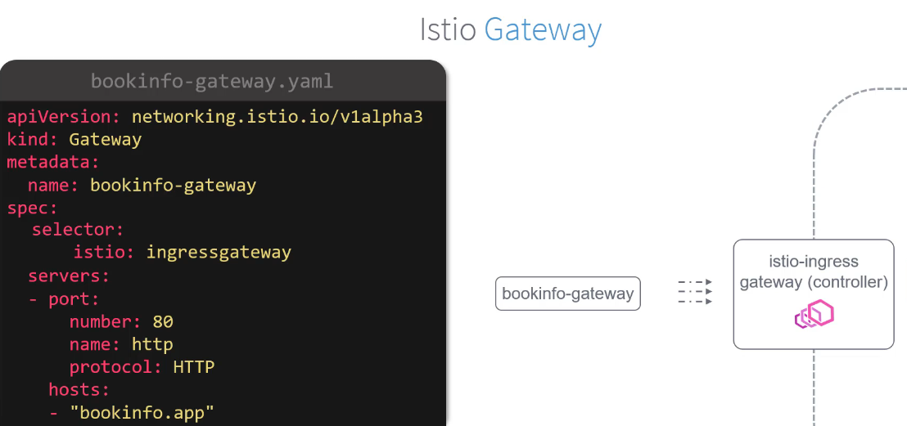

## Virtual services

- It stands between service and ingress gateway

  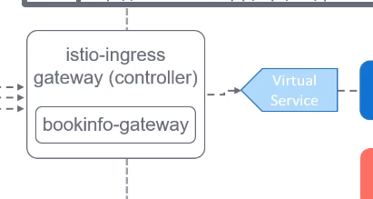

  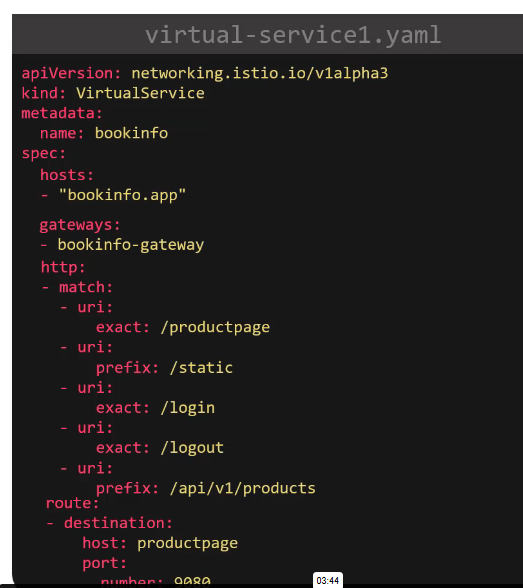

- Used also in canary control
  - It uses subset for controlling the traffic

    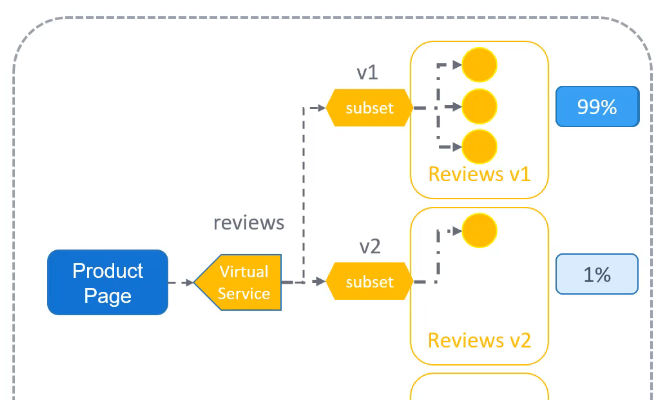

    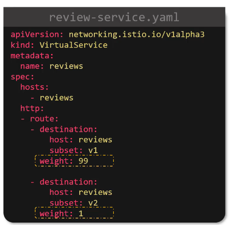

  - That means in anormal case for the above screenshots, the second deployment should get 25% of the traffic

- So what are subsets??? It comes from destination rules

## Destination rules

- Used to create subsets for deployment depending on its' labels

- As seen below

  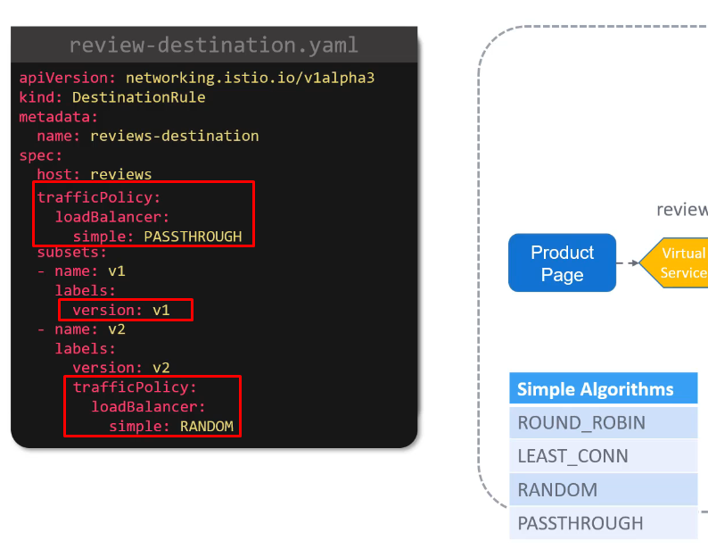

  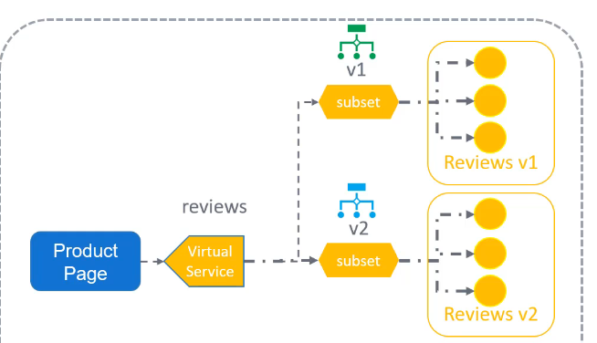

  the trafficpolicy can be applied equaly for all subsets, and also can be overwritten for individuals

  - Also the `version` label is related to the deployment

- Trafficepolicy can be tls as well

  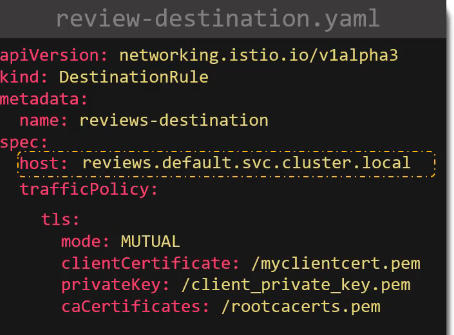

  - Above fully qualified domain name is recommended incase service is in another ns.

## Demo

Vreate th gateway and v-svc then do the following to try to access
```bash
export INGRESS_PORT=$(kubectl -n istio-system get service istio-ingressgateway -o jsonpath='{.spec.ports[?(@.name=="http2")].nodePort}')
export SECURE_INGRESS_PORT=$(kubectl -n istio-system get service istio-ingressgateway -o jsonpath='{.spec.ports[?(@.name=="https")].nodePort}')
export TCP_INGRESS_PORT=$(kubectl -n istio-system get service istio-ingressgateway -o jsonpath='{.spec.ports[?(@.name=="tcp")].nodePort}')
export INGRESS_HOST=$(kubectl get po -l istio=ingressgateway -n istio-system -o jsonpath='{.items[0].status.hostIP}')

curl -s -I -HHost:httpbin.example.com "http://$INGRESS_HOST:$INGRESS_PORT/status/200"
```

Another Demo for distination rule

```bash
export INGRESS_PORT=$(kubectl -n istio-system get service istio-ingressgateway -o jsonpath='{.spec.ports[?(@.name=="http2")].nodePort}')

export INGRESS_HOST=$(kubectl get po -l istio=ingressgateway -n istio-system -o jsonpath='{.items[0].status.hostIP}')

curl -HHost:myapp.example.com "http://$INGRESS_HOST:$INGRESS_PORT/myapp"
```

## Fault Injection

- You can set a fault in cases

  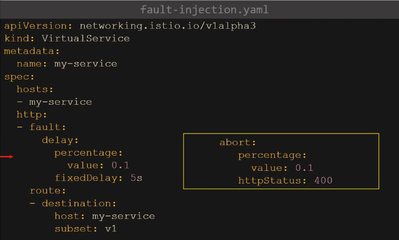

## Timeouts

- Internally you'll have internal virtual services between components. if there is a delay in one of the services it be a bottle neck for all the process

  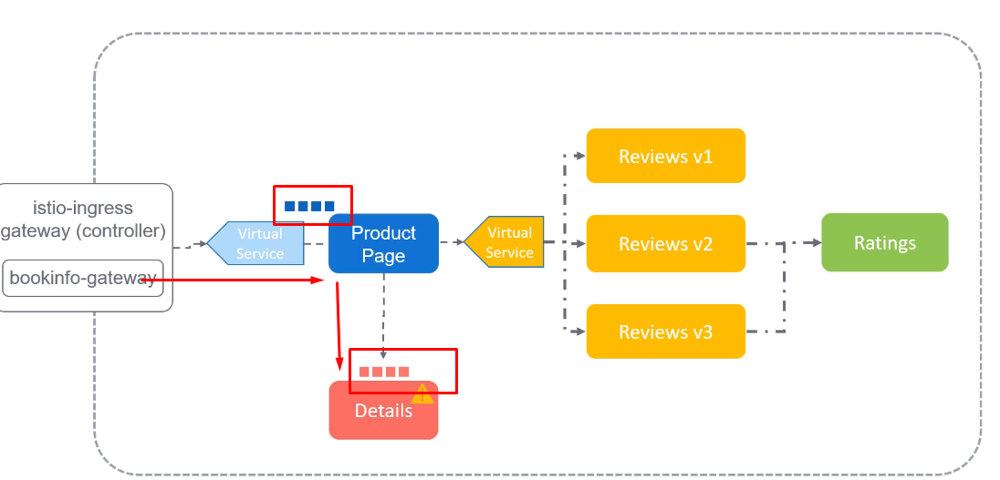

- In this case we would better make the upper service timeout before the the lower service and make it fail for 50% of the traffic

  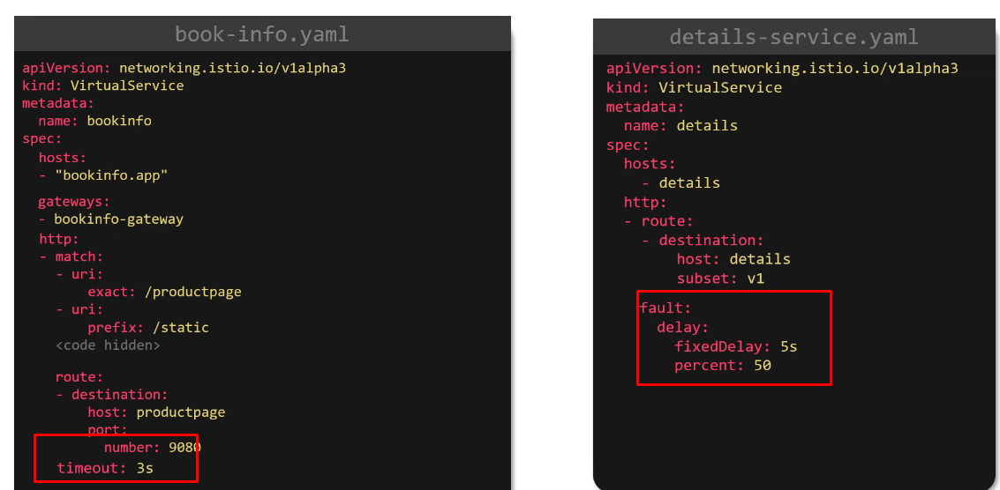

## Demo

`vs-with-fault.yaml`

## Retries

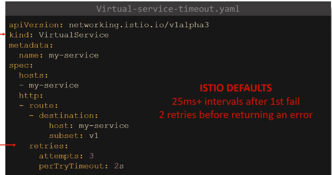

## Circuit Breaking

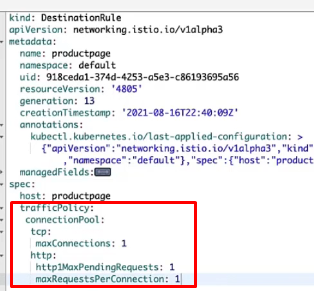

try with:
```bash
h2load -n1000 -c1 "http://...."
# 1000 request
# i connection
```

## Wrap up

```
ingress > Gateway > VS > SVC >>>
                        |       |
                        |       |
                        DR >>> POD
```

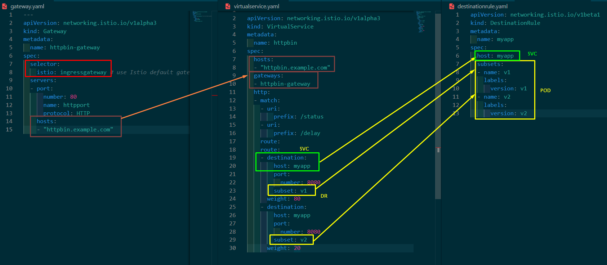

# Security


## Authentication

- It uses MTLS between 2 services (Peer auth)
- Peer authentication can be applied in the all ns when no labels set.
- and restricted to only workloads witht he label

  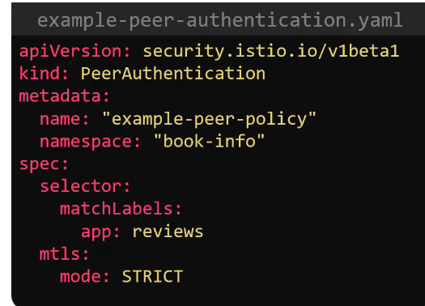

> If no label and in namespace `istio-system` it will be mesh-wide

## Authorization

- We can control only some requests like `GET`, but not other requests.
- There are 4 actions:
  - `Custom` will make an extention handles the request
  - `Audit` allow to audit if it matches the rule

    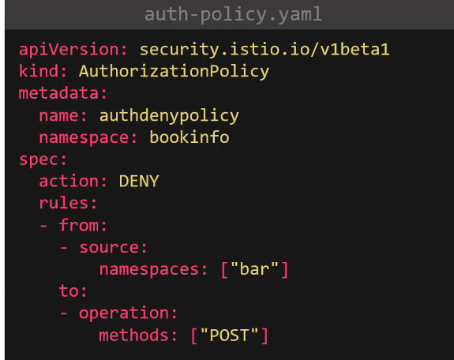

- The following with deny all

  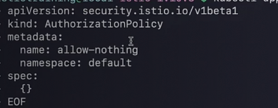

- add rule and check

  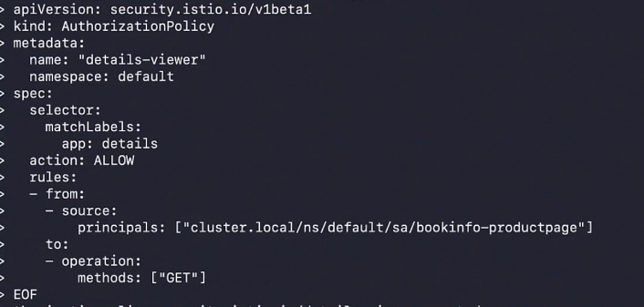

  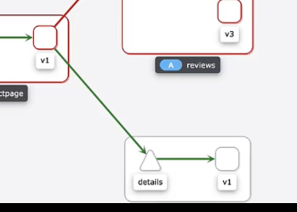

> As you've noticed, the labels matches the target and accepts the GET request from a specific sa only.

- So it's better to create an auth policy for each service 

## Cert manager

- Generate cacert from cert dir in the `istio-system` ns 
- All services will use this cert fo connection
- it uses `gRPC`


## Demo

After deplying the `auth.yaml` with GET request

Try to curl the svc in `demo-api` ns from `default` and `demo-app` ns

```bash
root@controlplane ~ ➜  kubectl exec curl-scq25   -c curl  -- curl -s 10.102.41.122 
RBAC: access denied
root@controlplane ~ ➜  kubectl exec curl-szftp -n demo-app -c curl  -- curl -s 10.102.41.122 
<!DOCTYPE html>
<html>
<head>
<title>Welcome to nginx!</title>
<style>
```

# Observability

Prom and grafana are deployed with istio

jaeger tracer

